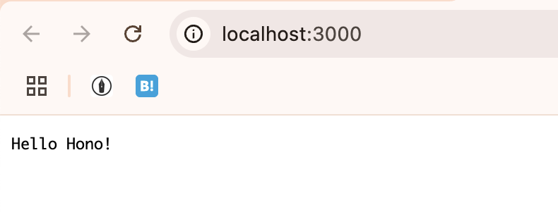
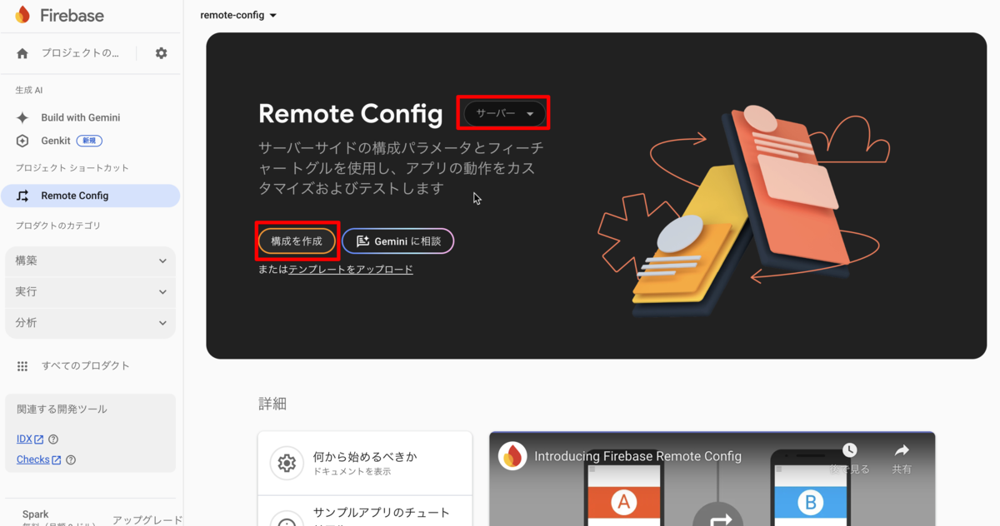
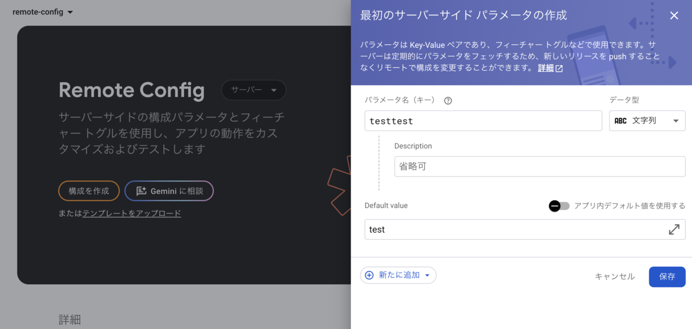
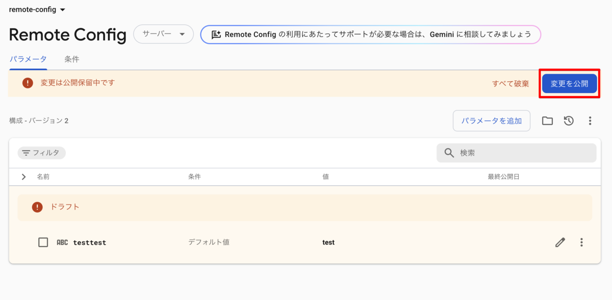
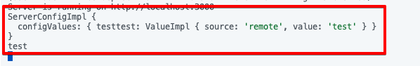
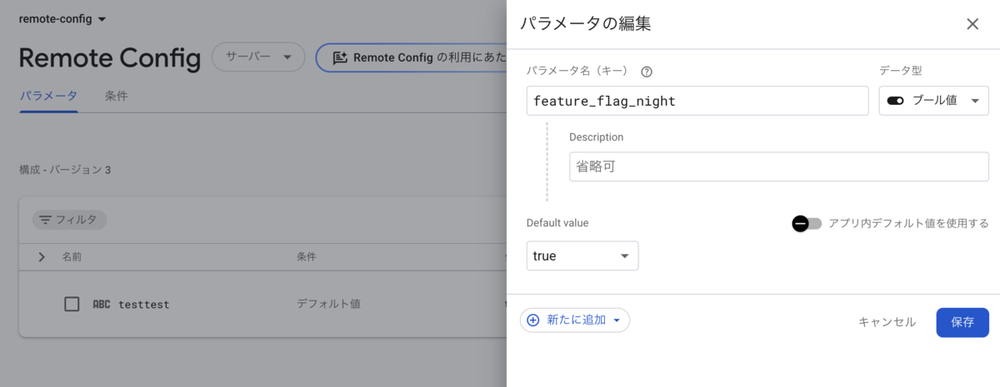
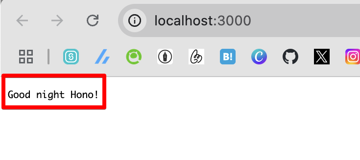

Firebase Remote Config で、Firebase Admin Node.js SDK v12.1.0 以降を使用したサーバーサイド構成がサポートされるようになった((記事執筆時点の2025/02/24時点ではプレビュー))。これを試してみる。

Feature Flag自体の説明はしないので知らない人は[これ](https://codezine.jp/article/detail/14114)を読んでほしい。

アプリケーション自体はFireabase SDKが入ればなんでもよかった。今回は環境作るのが爆速で個人的にも好きなHonoを使う。

## 環境

- Hono (4.7.2)
- Firebase Admin (13.1.0)

## Honoの環境を作る

https://hono.dev/docs/#quick-start

### 秒で終わる



## Firebase Adminを初期化

ドキュメントに書いてあるとおりやる。Firebase Projectはあらかじめ用意しておく。

[https://firebase.google.com/docs/admin/setup?hl=ja:embed:cite]

## Remote Configを用意する

地味にわかりづらいがオプションを「サーバー」にしておく必要がある。



試しに「testtest」という値を設定してみる。



編集後、「公開」を押す。



## Honoを修正

Hono側でFirebase SDKを初期化する。かつ、ドキュメントの説明に従ってRemote Configの読み込みを行う。

```ts ins={3-10, 15-16}
import { serve } from "@hono/node-server";
import { Hono } from "hono";
import { initializeApp } from "firebase-admin/app";
import { getRemoteConfig } from "firebase-admin/remote-config";

const firebaseApp = initializeApp();
const rc = getRemoteConfig(firebaseApp);
const template = rc.initServerTemplate();
await template.load();
const remoteConfig = template.evaluate();

const app = new Hono();

app.get("/", (c) => {
    console.log(remoteConfig);
    console.log(remoteConfig.getString("testtest"));
    return c.text("Hello Hono!");
});

serve(
    {
        fetch: app.fetch,
        port: 3000,
    },
    (info) => {
        console.log(`Server is running on http://localhost:${info.port}`);
    }
);
```

これで動かしてみると、consoleに以下のように表示された。一旦LGTM。



## Feature Flagとして使う

本題に入っていく。今度はFeature Flagとして使うにあたり`boolean`で値を登録してみる。



値を設定したうえで、Hono側を直す。Feature Flagが立っていれば、`Good night`と話してくれるはず。

```ts del={15-17} ins={18-21}
import { serve } from "@hono/node-server";
import { Hono } from "hono";
import { initializeApp } from "firebase-admin/app";
import { getRemoteConfig } from "firebase-admin/remote-config";

const firebaseApp = initializeApp();
const rc = getRemoteConfig(firebaseApp);
const template = rc.initServerTemplate();
await template.load();
const remoteConfig = template.evaluate();

const app = new Hono();

app.get("/", (c) => {
    console.log(remoteConfig);
    console.log(remoteConfig.getBoolean("feature_flag_night"));
    return c.text("Hello Hono!");
    const greet = remoteConfig.getBoolean("feature_flag_night")
        ? "Good night"
        : "Hello";
    return c.text(`${greet} Hono!`);
});

serve(
    {
        fetch: app.fetch,
        port: 3000,
    },
    (info) => {
        console.log(`Server is running on http://localhost:${info.port}`);
    }
);
```

結果、表示が変わった。LGTM。



## おわりに

Remote Configがサポートしてるデータ型は文字列・数値・ブール値・JSONだ。今回は検証で1つのFeature Flagしかなかったが、通常たくさん生えてなおかつ機能のサブ機能とかが現れたりすることもあるのでJSONで管理しておくのがよさそう。

...そうなると環境変数で管理してるのとそう変わらない気がしてきた。ただRemote Configの条件とかを使える強みはありそう。個人的にはRemote Configは結構いいかもと思っている。

[https://firebase.google.com/docs/remote-config/parameters?template_type=server&hl=ja#condition-rule-types:embed:cite]

---

この記事は当初はてなブログで公開したものを個人ブログ開設にあたって移植したものです。

https://blog.inorinrinrin.com/entry/2025/02/24/111942
