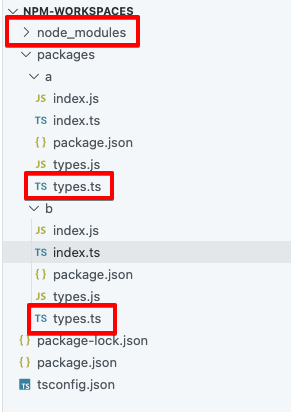

npm workspacesとTurborepoの違いというか役割分担をよくわかっていなかったので、改めて勉強してそのメモを残しておこうという記事。

# npm workspaces

npm v7から導入された機能。モノレポの依存関係をいい感じに管理できる。

# まずは基本的なnpm workspacesの使い方

ほぼドキュメント通りだがハンズオンするとイメージが湧きやすいのでやる。

まず`npm init`でnpmプロジェクトの雛形を作る。


workspaceを作っていく。まずは`unjs/citty`のissueを`ofetch`で取得するリポジトリ`a`を作ってみる。

`npm init -w ./packages/a`するとこういうのができる。

```json title="packages/a/package.json"
{
    "name": "a",
    "version": "1.0.0",
    "description": "",
    "license": "ISC",
    "author": "",
    "type": "commonjs",
    "main": "index.js",
    "scripts": {
        "test": "echo \"Error: no test specified\" && exit 1"
    },
}
```

このワークスペースの中に`ofetch`を入れる。

`npm install ofetch -w ofetch`

するとこうなる。

```json title="packages/a/package.json" ins={12-14}
{
    "name": "a",
    "version": "1.0.0",
    "description": "",
    "license": "ISC",
    "author": "",
    "type": "commonjs",
    "main": "index.js",
    "scripts": {
        "test": "echo \"Error: no test specified\" && exit 1"
    },
    "dependencies": {
        "ofetch": "^1.4.1"
    }
}
```

今度はプロジェクト全体で`zod`を使えるようにする。

`npm install zod`

これで`package.json`を見比べると、それぞれで依存関係を管理できていることがわかる。


### ここまでの成果物を実行する

```ts title="packages/a/index.ts"
import { ofetch } from "ofetch";
import { parseGitHubIssueResponse } from "./types";

const fetchIssue = async () => {
    const url = "https://api.github.com/repos/unjs/citty/issues?state=open";
    const data = await ofetch(url, {
        method: "GET",
        headers: {
            Accept: "application/vnd.github.v3+json",
        },
    });
    const issues = data;
    console.log("Fetched issues:", issues);
    const parsedIssues = issues.map((issue: unknown) =>
        parseGitHubIssueResponse(issue)
    );
    console.log("Parsed issues:", parsedIssues);
};

fetchIssue();
```

```bash
npm-workspaces % cd ./packages/a
a % npx tsc
a % node index.js
```

結果、issueが取得できた。


# workspaceを増やす

`a`を作ったのと同じ要領で今度は`b`を作り、こちらは`axios`を入れてみる。

```bash
npm init -w ./packages/b
npm install axios -w b
```

すると`a`は`ofetch`が入っていて、`b`は`axios`が入っているのがわかる。


こちらは`axios`を使ってissueを取得してみる。

```ts title="packages/b/index.ts"
import axios from "axios";
import { parseGitHubIssueResponse } from "./types";

const fetchIssue = async () => {
    const url = "https://api.github.com/repos/unjs/citty/issues?state=open";
    try {
        const response = await axios.get(url, {
            headers: {
                Accept: "application/vnd.github.v3+json",
            },
        });
        const issues = response.data;
        console.log("Fetched issues:", issues);
        const parsedIssues = issues.map((issue: unknown) =>
            parseGitHubIssueResponse(issue)
        );
        console.log("Parsed issues:", parsedIssues);
    } catch (error) {
        console.error("Error fetching issues:", error);
    }
};

fetchIssue();

```

同じように取得できた。


あとはそれぞれの`package.json`にそれぞれでテストを書いたり、必要な`npm script`を定義したりするとパッケージ単位にコマンドを実行したりできる。

`npm run test --workspace=a --workspace=b`のように複数のワークスペースも対象にもできる。

ここまでは一見よさげだが、まだ完全体ではない。

# ここまでで不完全なところ

まず上の`a`と`b`のそれぞれでissueをfetchできたリポジトリの状態を見てほしい。



### ルートにある`node_modules`の中身を`require`している

今のプロジェクトの状態で`tsc`してできたjsをみてほしい。

```js title="packages/a/index.js" {12}
"use strict";
var __awaiter = (this && this.__awaiter) || function (thisArg, _arguments, P, generator) {
    function adopt(value) { return value instanceof P ? value : new P(function (resolve) { resolve(value); }); }
    return new (P || (P = Promise))(function (resolve, reject) {
        function fulfilled(value) { try { step(generator.next(value)); } catch (e) { reject(e); } }
        function rejected(value) { try { step(generator["throw"](value)); } catch (e) { reject(e); } }
        function step(result) { result.done ? resolve(result.value) : adopt(result.value).then(fulfilled, rejected); }
        step((generator = generator.apply(thisArg, _arguments || [])).next());
    });
};
Object.defineProperty(exports, "__esModule", { value: true });
const ofetch_1 = require("ofetch");
const types_1 = require("../types");
const fetchIssue = () => __awaiter(void 0, void 0, void 0, function* () {
    const url = "https://api.github.com/repos/unjs/citty/issues?state=open";
    const data = yield (0, ofetch_1.ofetch)(url, {
        method: "GET",
        headers: {
            Accept: "application/vnd.github.v3+json",
        },
    });
    const issues = data;
    console.log("Fetched issues:", issues);
    const parsedIssues = issues.map((issue) => (0, types_1.parseGitHubIssueResponse)(issue));
    console.log("Parsed issues:", parsedIssues);
});
fetchIssue();
```

どうも現状はルートにある`node_modules`の中身を`require`しているらしい。

つまりこのままだとマイクロサービス(例えばFaaSなど)に`a`と`b`のそれぞれをデプロイする場合にもプロジェクト全体を置く必要があることを意味する。なぜなら`node_modules`はルートにできているからだ。

### `types.ts`が複数できている

ここで`a`と`b`の`types.ts`をお見せする。ちなみに内容はどちらも同じだ。

```ts title="types.ts"
import { z } from "zod";

// Define the schema for a GitHub issue response
const GitHubIssueSchema = z.object({
    id: z.number(),
    node_id: z.string(),
    url: z.string().url(),
    repository_url: z.string().url(),
    labels_url: z.string().url(),
    comments_url: z.string().url(),
    events_url: z.string().url(),
    html_url: z.string().url(),
    number: z.number(),
    state: z.string(),
    title: z.string(),
    body: z.string().nullable(),
    user: z.object({
        login: z.string(),
        id: z.number(),
        node_id: z.string(),
        avatar_url: z.string().url(),
        gravatar_id: z.string().nullable(),
        url: z.string().url(),
        html_url: z.string().url(),
        followers_url: z.string().url(),
        following_url: z.string(),
        gists_url: z.string(),
        starred_url: z.string(),
        subscriptions_url: z.string().url(),
        organizations_url: z.string().url(),
        repos_url: z.string().url(),
        events_url: z.string(),
        received_events_url: z.string().url(),
        type: z.string(),
        site_admin: z.boolean(),
    }),
    labels: z.array(
        z.object({
            id: z.number(),
            node_id: z.string(),
            url: z.string().url(),
            name: z.string(),
            color: z.string(),
            default: z.boolean(),
            description: z.string().nullable(),
        })
    ),
    assignee: z
        .object({
            login: z.string(),
            id: z.number(),
            node_id: z.string(),
            avatar_url: z.string().url(),
            gravatar_id: z.string().nullable(),
            url: z.string().url(),
            html_url: z.string().url(),
            followers_url: z.string().url(),
            following_url: z.string(),
            gists_url: z.string(),
            starred_url: z.string(),
            subscriptions_url: z.string().url(),
            organizations_url: z.string().url(),
            repos_url: z.string().url(),
            events_url: z.string(),
            received_events_url: z.string().url(),
            type: z.string(),
            site_admin: z.boolean(),
        })
        .nullable(),
    assignees: z
        .array(
            z.object({
                login: z.string(),
                id: z.number(),
                node_id: z.string(),
                avatar_url: z.string().url(),
                gravatar_id: z.string().nullable(),
                url: z.string().url(),
                html_url: z.string().url(),
                followers_url: z.string().url(),
                following_url: z.string(),
                gists_url: z.string(),
                starred_url: z.string(),
                subscriptions_url: z.string().url(),
                organizations_url: z.string().url(),
                repos_url: z.string().url(),
                events_url: z.string(),
                received_events_url: z.string().url(),
                type: z.string(),
                site_admin: z.boolean(),
            })
        )
        .nullable(),
    comments: z.number(),
    created_at: z.string(),
    updated_at: z.string(),
    closed_at: z.string().nullable(),
    author_association: z.string(),
    active_lock_reason: z.string().nullable(),
});

// Function to parse and validate the GitHub issue response
export const parseGitHubIssueResponse = (response: unknown) => {
    const result = GitHubIssueSchema.safeParse(response);

    if (!result.success) {
        console.error("Invalid GitHub issue response:", result.error);
        return null;
    }

    return result.data;
};
```

これは完全にDRY原則違反なので、ここで新たに`npm init -w ./packages/types`でパッケージを追加するとしよう。

その下に`index.ts`を作り、元の`types.ts`を移植する。結果こうなる。


そして`packages/b/index.ts`はこうなる。

```ts title="packages/b/index.ts" del={2} ins={3}
import axios from "axios";
import { parseGitHubIssueResponse } from "./types";
import { parseGitHubIssueResponse } from "../types";

const fetchIssue = async () => {
    const url = "https://api.github.com/repos/unjs/citty/issues?state=open";
    try {
        const response = await axios.get(url, {
            headers: {
                Accept: "application/vnd.github.v3+json",
            },
        });
        const issues = response.data;
        console.log("Fetched issues:", issues);
        const parsedIssues = issues.map((issue: unknown) =>
            parseGitHubIssueResponse(issue)
        );
        console.log("Parsed issues:", parsedIssues);
    } catch (error) {
        console.error("Error fetching issues:", error);
    }
};

fetchIssue();

```

これをビルドし実行してみると…


確かにissueは取れた。一見いい感じに共通部品を別のパッケージに切り出せたように見える。しかし、「よっしゃこれがTypeScriptのモノレポのパワーやで〜🎉」とはならない。理由はビルドされたJSを見ればわかる。

```ts title="packages/a/dist/index.js" {16}
"use strict";
var __awaiter = (this && this.__awaiter) || function (thisArg, _arguments, P, generator) {
    function adopt(value) { return value instanceof P ? value : new P(function (resolve) { resolve(value); }); }
    return new (P || (P = Promise))(function (resolve, reject) {
        function fulfilled(value) { try { step(generator.next(value)); } catch (e) { reject(e); } }
        function rejected(value) { try { step(generator["throw"](value)); } catch (e) { reject(e); } }
        function step(result) { result.done ? resolve(result.value) : adopt(result.value).then(fulfilled, rejected); }
        step((generator = generator.apply(thisArg, _arguments || [])).next());
    });
};
var __importDefault = (this && this.__importDefault) || function (mod) {
    return (mod && mod.__esModule) ? mod : { "default": mod };
};
Object.defineProperty(exports, "__esModule", { value: true });
const axios_1 = __importDefault(require("axios"));
const types_1 = require("../types");
const fetchIssue = () => __awaiter(void 0, void 0, void 0, function* () {
    const url = "https://api.github.com/repos/unjs/citty/issues?state=open";
    try {
        const response = yield axios_1.default.get(url, {
            headers: {
                Accept: "application/vnd.github.v3+json",
            },
        });
        const issues = response.data;
        console.log("Fetched issues:", issues);
        const parsedIssues = issues.map((issue) => (0, types_1.parseGitHubIssueResponse)(issue));
        console.log("Parsed issues:", parsedIssues);
    }
    catch (error) {
        console.error("Error fetching issues:", error);
    }
});
fetchIssue();

```

`const types_1 = require("../types");`となっている。つまり単に`packages/types`のモジュールを呼んでいるにすぎない。

そう。これをマイクロサービスなどにデプロイすることを考えると、結局「`node_modules`はルートにできている」問題と同じところに帰結する。

### 解決編

しかしこれらはいずれも全く問題ない。結局どちらの場合もバンドラがないために起こっている問題だからだ。というわけで今回は`esbuild`を突っ込んで改めてビルドする。

```bash
npm-workspaces % npm install --save-dev esbuild
npm-workspaces % cd ./packages/a
a % esbuild index.ts --bundle --platform=node --target=node22 --outdir=dist
```

すると、


となり、いい感じにビルドしてくれた。

# npm workspaces の役割

ここまでで一度npm workspacesの役割を整理する。

- パッケージの依存関係管理を一元化できる
- ワークスペース間での依存リンク（symlink）を自動で設定
- 各パッケージの `node_modules` を共有して効率化

つまり、npm workspacesは「モノレポ構成で依存関係の管理を簡単にする」ための機能。

# Turborepo の特徴と利点

一方でTurborepo は `npm workspaces` や `pnpm workspaces` を**ベースにして**、追加機能を提供するツール。

### 追加機能1: 高速なビルドとキャッシュ

- タスクの並列・依存解決実行（ビルド、lint、test など）
- **ローカルキャッシュ** + **リモートキャッシュ（Vercelと連携）**

```bash
turbo run build
```

依存関係を自動解析し、必要な順序で高速ビルド＋キャッシュを活用。

### 追加機能2: 柔軟なタスク定義

- `package.json` に依存せず、`turbo.json` でパイプライン定義が可能
- 例：「lint → build → test」などを順序づけて実行できる

---

### 追加機能3: 差分ビルド（Incremental Build）

- Gitベースで変更検知
- **変更があったパッケージだけ**をビルド・テストする

# まとめ

| 機能                   | npm workspaces | Turborepo                 |
|------------------------|----------------|---------------------------|
| 依存管理               | ✅              | ✅（workspaces に依存）     |
| タスクの依存解決       | ❌              | ✅                        |
| 差分ビルド / キャッシュ | ❌              | ✅                        |
| リモートキャッシュ     | ❌              | ✅（Vercel と連携）         |
| パイプライン定義       | ❌              | ✅                        |
| CI/CD 最適化           | ❌              | ✅                        |

以上から、モノレポが中〜大規模になってきて、

- **CI の速度を上げたい**
- **差分だけ**ビルド・テストしたい

みたいな段階になってTurborepoは登場するという感じだ。

npm or pnpm のどちらのworkspace機能を使うのか？という話はnpm vs pnpm の話なのでこの記事では扱わないこととする。ただOSSを見てるとほとんどはpnpmを使ってるなという印象がある。
