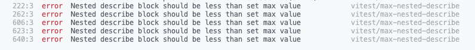
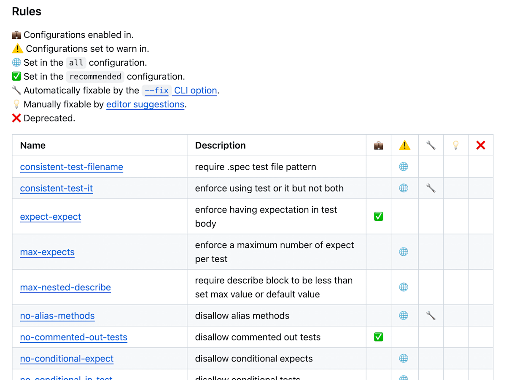

このポストを見て「`vitest`に対するLinterがあるのか〜」となり、導入してみることにした。

https://x.com/vitest_dev/status/1823317887051759787

# 導入

簡単で、リポジトリの`README`のとおりそのままやればOK

https://github.com/vitest-dev/eslint-plugin-vitest?tab=readme-ov-file

eslintは入っている前提で、

```bash
npm install @vitest/eslint-plugin --save-dev
```

して、`eslint.config.js`(eslint 9系の場合)とかに以下を追加する。

```js ins={1, 4-12}
import vitest from "@vitest/eslint-plugin";

export default [
  {
    files: ["tests/**"], // テストコードにマッチする形に直す
    plugins: {
      vitest
    },
    rules: {
      ...vitest.configs.recommended.rules,
    },
  },
;
```

これで推奨設定が当たるようになったので、`npm run lint`とかで確認してみる。

そのまえに、試しに厳しめの設定を追加する。

基本的に全てのルールは`off`,`warn`,`error`の3段階で設定できるようになっていて、それ以外のオプション設定については公式の`README`に記載の通り設定をしていく。

```js ins={11-12}
import vitest from "@vitest/eslint-plugin";

export default [
  {
    files: ["tests/**"], // or any other pattern
    plugins: {
      vitest
    },
    rules: {
      ...vitest.configs.recommended.rules, // you can also use vitest.configs.all.rules to enable all rules
     // e.g. 'vitest/no-test-return-statement': 'error',
      "vitest/max-nested-describe": ["error", { "max": 1 }] // you can also modify rules' behavior using option like this
    },
  },
];
```

これで`describe`の中に`describe`がある箇所はエラーになる。



こういう感じでエラーになってくれた。

# お作法学習パート

リポジトリの`README`を見ると、どのルールが有効でどのルールが警告か？がわかる。



これを見れば、`テストコードはこう書くべき`というvitest公式の思想を学習でき、その中で共感できたルールを設定していく。

以下、自分がいいなと思ったルール。

## consistent-test-it

https://github.com/vitest-dev/eslint-plugin-vitest/blob/main/docs/rules/consistent-test-it.md

テストの記述を`it`か`test`に統一できるルール。

## no-conditional-xxx 系

https://github.com/vitest-dev/eslint-plugin-vitest/blob/main/docs/rules/no-conditional-expect.md

https://github.com/vitest-dev/eslint-plugin-vitest/blob/main/docs/rules/no-conditional-in-test.md

https://github.com/vitest-dev/eslint-plugin-vitest/blob/main/docs/rules/no-conditional-tests.md

テストの中で`if`などの条件分岐を用いてアサーションを変えたり、実行するテストを変えたりするルール。

問答無用で有効にする。

(そういうコードをやりたいなら、そもそもテストケースを分けるべき)

## no-disabled-tests

https://github.com/vitest-dev/eslint-plugin-vitest/blob/main/docs/rules/no-disabled-tests.md

`test.skip`を許容しないルール。これは好みだと思う。

自分は実行しないのであればコメントアウトしておくか、コードを削除する方が好き。

skipにしてて、近い将来また戻すっていうパターンにあんまり出会ったことがないので・・・

## no-duplicate-hooks

https://github.com/vitest-dev/eslint-plugin-vitest/blob/main/docs/rules/no-duplicate-hooks.md

`beforeEach`などを重複で書けないようにするルール。

## no-identical-title

https://github.com/vitest-dev/eslint-plugin-vitest/blob/main/docs/rules/no-identical-title.md

テストタイトルが重複しないようにするルール。

`JUnit`とかであれば普通に怒ってくれるけど`vitest`(というかTS？)では怒ってくれないので、設定しておく。

## no-test-return-statement

https://github.com/vitest-dev/eslint-plugin-vitest/blob/main/docs/rules/no-test-return-statement.md

テストコード(`it`, `test`)の中で`return`を禁止するルール。

基本的に使う画面がないので、設定しておく。

## prefer-mock-promise-shorthand

https://github.com/vitest-dev/eslint-plugin-vitest/blob/main/docs/rules/prefer-mock-promise-shorthand.md

`mockReturnValue`とか`mockImplementation`のなかで`Promise`を使わせないようにするルール。

冗長になるので、vitestが用意してくれている`mockRejectedValue`, `mockResolvedValue`を使う。

## require-hook

https://github.com/vitest-dev/eslint-plugin-vitest/blob/main/docs/rules/require-hook.md

`describe`のコードブロックのトップレベルでメソッドなどがコールされている場合、`before`などを使うように怒ってくれます。

## require-to-throw-message

https://github.com/vitest-dev/eslint-plugin-vitest/blob/main/docs/rules/require-to-throw-message.md

`toThrow`など例外をアサーションする際には、エラーメッセージも併せて検証するように怒ってくれるルールです。

適切なエラーメッセージが設定されているか？を見直すきっかけにもなるので、設定しておきたい。

## require-top-level-describe

https://github.com/vitest-dev/eslint-plugin-vitest/blob/main/docs/rules/require-top-level-describe.md

テストコードにてネスト可能な`describe`の数を制限できるようにするルール。

デフォルトでは無限なのですが、基本的に2ネストを超える場合はテストを分割する方がよいと考えているので、自分は2で設定しています。

# おわりに

テストコードのお作法って意外とチームによって違ってたりするので、テストコードに対するlintをかけられるのはありがたいですよね。

まだあまりissueも立ってないようなので、自分も使ってみて気になったところにPR出してみたい。

---

この記事は当初Zennで公開したものを個人ブログ開設にあたって移植したものです。

https://zenn.dev/yskn_sid25/articles/8ff70404804f60
