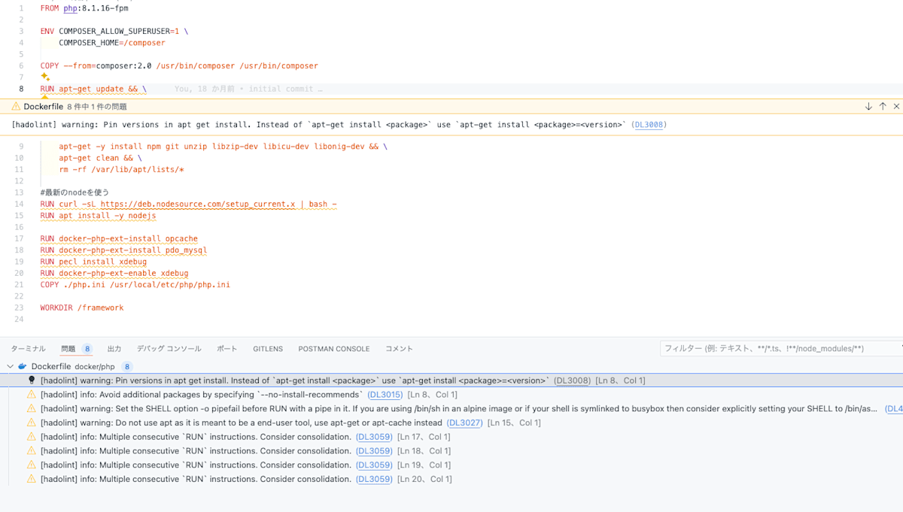
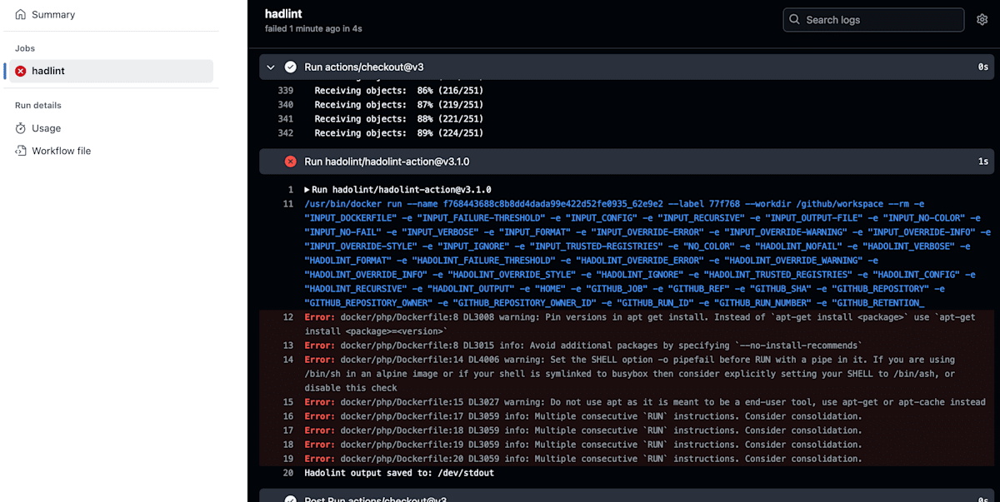
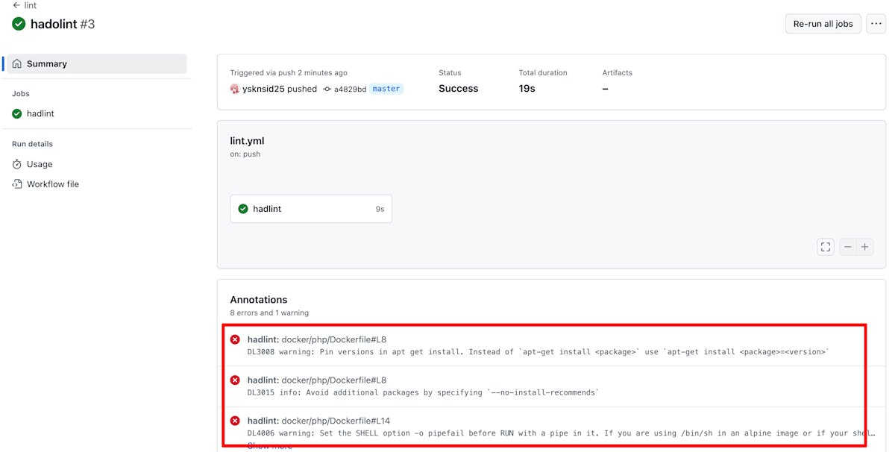

Dockerは公式にDockerfileのベストプラクティスを表明しています。

https://docs.docker.com/build/building/best-practices/

が、このベストプラクティスに沿っているかどうか？を人間がいちいちレビューしていくのは正直しんどい、というか現実的ではない…

そこで「せや！静的解析したろ！」という時に便利なのが**hadolint**というライブラリです。

https://github.com/hadolint/hadolint

# 使ってみる

今回はVSCode拡張機能とGHAのCI時に静的解析してもらいたいと思います。

今回はちょうどメンテナンスしていない自分のリポジトリがあるので、これに対して静的解析をかけていきます。

https://github.com/ysknsid25/otaku-tool

まずはVSCode拡張機能で利用するための下準備として、hadolint本体をOSにインストールします。

Macの場合はこちら。

```bash
brew install hadolint
```

それ以外の場合はこちらをご参照ください。

https://github.com/hadolint/hadolint#install

インストールが終わったら、まずはCLIで実行してみます。

```bash
hadolint 対象のDockerfile
```

すると、こういう感じで怒ってくれました。

```bash
docker/php/Dockerfile:8 DL3008 warning: Pin versions in apt get install. Instead of `apt-get install <package>` use `apt-get install <package>=<version>`
docker/php/Dockerfile:8 DL3015 info: Avoid additional packages by specifying `--no-install-recommends`
docker/php/Dockerfile:14 DL4006 warning: Set the SHELL option -o pipefail before RUN with a pipe in it. If you are using /bin/sh in an alpine image or if your shell is symlinked to busybox then consider explicitly setting your SHELL to /bin/ash, or disable this check
docker/php/Dockerfile:15 DL3027 warning: Do not use apt as it is meant to be a end-user tool, use apt-get or apt-cache instead
docker/php/Dockerfile:17 DL3059 info: Multiple consecutive `RUN` instructions. Consider consolidation.
docker/php/Dockerfile:18 DL3059 info: Multiple consecutive `RUN` instructions. Consider consolidation.
docker/php/Dockerfile:19 DL3059 info: Multiple consecutive `RUN` instructions. Consider consolidation.
docker/php/Dockerfile:20 DL3059 info: Multiple consecutive `RUN` instructions. Consider consolidation.
```

ではVSCode拡張機能で確認してみます。

## VSCode拡張機能でhadolintを使う

フィードバックループを短くするための静的解析であり、最短のフィードバックループを獲得するにはやはり開発時にリアルタイムで怒られたい。

ということでVSCodeの拡張機能でhadolintに怒ってもらいたいと思います。

https://marketplace.visualstudio.com/items?itemName=exiasr.hadolint

有効にすると、CLIをあらかじめ入れておくだけでこのようにエディタの上で視覚的に怒ってくれるようになりました。



## GitHub Actionsでhadolintを使う

次に開発時に気づかなかった場合などに備えて、CIのタイミングでも静的解析を実行し、警告やエラーがある場合はインテグレーションを中止するように設定していきます。

ここではGitHub Actionsを使ってhadlintによる静的解析を実行します。

今回は簡単に検証したいだけなので、雑にこういう感じでworkflowを用意します。

```yml
name: lint

on:
    push:

jobs:
    lint:
        name: hadlint
        runs-on: ubuntu-latest

        steps:
            - uses: actions/checkout@v3
            - uses: hadolint/hadolint-action@v3.1.0
              with:
                dockerfile: docker/php/Dockerfile
                failure-threshold: warning
```

`failure-threshold`でCIが失敗するhadolintのエラーレベルを指定できます。

今回は警告の場合でもCIが失敗するようにしてみます。



VSCode拡張機能で出ていた内容と同じエラーが表示され、CIが失敗してくれました。

一方で`failure-threshold`を`error`とすると…？

CI自体には成功しましたが、警告は出してくれています。



# おわりに

以上、hadolintの使い方でした。

hadolintに行き着いたきっかけはCloudRunやFargateのようなCaaSを使う機会が増えたからです。

「Dockerfile自体の脆弱性を減らしたり、お作法を守って書きたいな〜」というところでhadolintに行き着きました。

導入も設定もめちゃくちゃ簡単なので、これからはDockerfileを書くときは常に有効にしておきたいです。

---

この記事は当初Zennで公開したものを個人ブログ開設にあたって移植したものです。

https://zenn.dev/yskn_sid25/articles/caf5d26ae8a743
