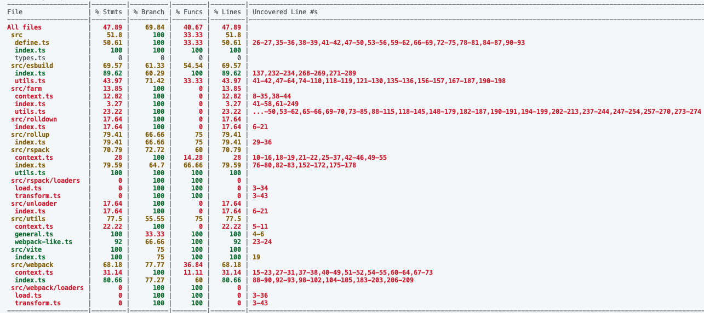
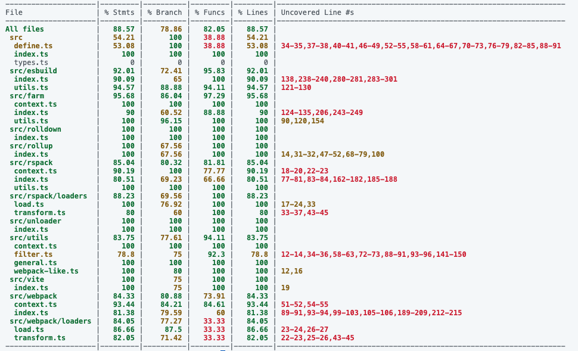
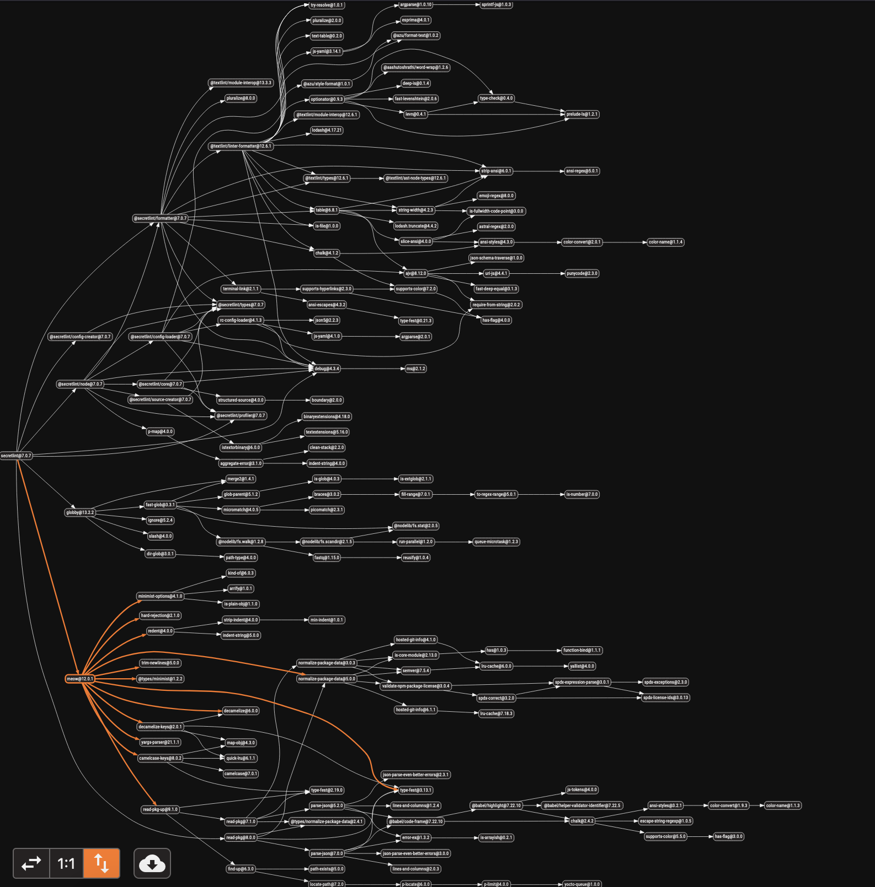

I would like to report on my OSS activities in the past month.

# Improved coverage of unplugin

When I ran the unplugin test, I noticed something. That is, coverage is much lower than in other UnJS projects. I immediately put out a [issue](https://github.com/unjs/unplugin/issues/489).

[@sxzz](https://github.com/sxzz) immediately responded favorably to this issue and I immediately started working on improving it.

As a result, coverage was significantly improved as follows.

- statement: 47.89 -> **88.57**
- branch: 69.84 -> 78.86
- function: 40.67 -> **82.05**
- lines: 47.89 -> **88.57**

**before**

**after**

Also, on a minor note, I was able to repair the broken Linter settings.

## PRs

- https://github.com/unjs/unplugin/pull/492
- https://github.com/unjs/unplugin/pull/493
- https://github.com/unjs/unplugin/pull/496
- https://github.com/unjs/unplugin/pull/497
- https://github.com/unjs/unplugin/pull/498
- https://github.com/unjs/unplugin/pull/491/files

# Use utils.parseArgs instead of meow in Secretlint

Secretlint is a linter that detects and prevents secret information from being mixed in with your project. Please read the project [README](https://github.com/secretlint/secretlint) for more details.

Secretlint runs on the CLI, but I was using [meow](https://github.com/sindresorhus/meow) to parse its arguments.

But `meow` is unnecessarily vast with the following dependencies.

Therefore, we refactored to reduce dependencies by replacing it with the node standard `utils.parseArgs`.

The modification did not go smoothly, and it was necessary to implement help, version display, etc. on our own, so meow analysis was required to ensure consistency between the old and the new.

## PR

https://github.com/secretlint/secretlint/pull/986

# Conclusion

There are many other minor corrections and unmerged PRs. But the main fixes were these two. I will do my best to contribute again next month.
