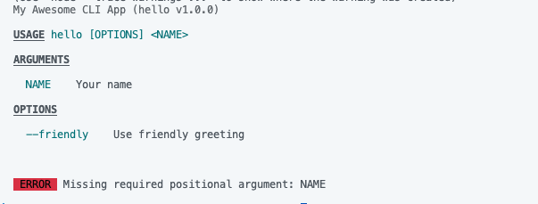
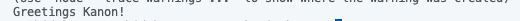
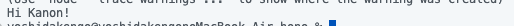
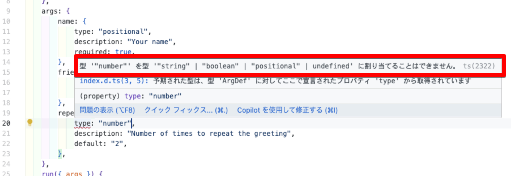
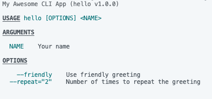
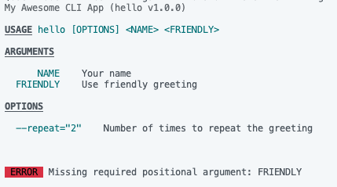
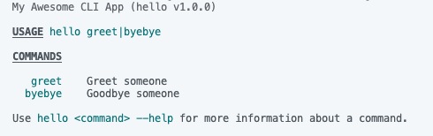
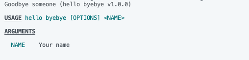

# citty

https://unjs.io/packages/citty

Nitroとかh3とかいろいろいい感じのライブラリを作ってるUnJSのライブラリの一つ。いい感じにCLIツールを作れる。

# 準備

```bash
npm install citty
```

公式のサンプルソースを拝借。

```typescript
import { defineCommand, runMain } from "citty";

const main = defineCommand({
    meta: {
        name: "hello",
        version: "1.0.0",
        description: "My Awesome CLI App",
    },
    args: {
        name: {
            type: "positional",
            description: "Your name",
            required: true,
        },
        friendly: {
            type: "boolean",
            description: "Use friendly greeting",
        },
    },
    run({ args }) {
        console.log(`${args.friendly ? "Hi" : "Greetings"} ${args.name}!`);
    },
});

runMain(main);
```

# 基本

以下、あえて間違った動かし方をしてみる。

```bash
node --experimental-strip-types index.ts
```



かなり親切に怒ってくれる。オプションなしで実行してみると…

```bash
node --experimental-strip-types index.ts Kanon
```



オプションをつける。

```bash
node --experimental-strip-types index.ts Kanon --friendly true
```

フレンドリーになった。



# argsのtypeについて

```
    args: {
        name: {
            type: "positional",
            description: "Your name",
            required: true,
        },
        friendly: {
            type: "boolean",
            description: "Use friendly greeting",
        },
    },
```

ここで試しに`type`に`number`を指定してみると怒られる。



実装をみると以下のようになっている。

```typescript
type ArgType = "boolean" | "string" | "positional" | undefined;
```

どうやら4つを指定できるらしい。`string`, `boolean`はわかるが`positional`とはなにか。これは`--help`で見てみるとわかる。まずは以下のように引数を定義して`--help`する。

```typescript
    args: {
        name: {
            type: "positional",
            description: "Your name",
            required: true,
        },
        friendly: {
            type: "boolean",
            description: "Use friendly greeting",
        },
        repeat: {
            type: "string",
            description: "Number of times to repeat the greeting",
            default: "2",
        },
    },
```

helpもめっちゃわかりやすい。



では次に、`friendly`を`positional`に変えてみる。

```diff
    args: {
        name: {
            type: "positional",
            description: "Your name",
            required: true,
        },
        friendly: {
-            type: "boolean",
+            type: "positional",
            description: "Use friendly greeting",
        },
        repeat: {
            type: "string",
            description: "Number of times to repeat the greeting",
            default: "2",
        },
    },
```


`--friendly`から`FRIENDLY`に変わったのがわかるだろうか。つまり、「`positional`は`args`に指定された順番で受け取るよ」ということらしい。試しに以下のように実行してみると…

```bash
node --experimental-strip-types index.ts Kanon
```

`FRIENDLY`を指定しろと怒られた。



# サブコマンド

サブコマンドを実装することもできる。以下のように二つのサブコマンドを実装してみる。

```typescript
import { defineCommand, runMain } from "citty";

const greet = defineCommand({
    meta: {
        name: "greet",
        description: "Greet someone",
    },
    args: {
        name: {
            type: "positional",
            description: "Your name",
            required: true,
        },
        friendly: {
            type: "boolean",
            description: "Use friendly greeting",
        },
    },
    run({ args }) {
        console.log(`${args.friendly ? "Hi" : "Greetings"} ${args.name}!`);
    },
});

const byebye = defineCommand({
    meta: {
        name: "byebye",
        description: "Goodbye someone",
    },
    args: {
        name: {
            type: "positional",
            description: "Your name",
            required: true,
        },
    },
    run({ args }) {
        console.log(`byebye👋 ${args.name}!`);
    },
});

const main = defineCommand({
    meta: {
        name: "hello",
        version: "1.0.0",
        description: "My Awesome CLI App",
    },
    subCommands: {
        greet,
        byebye,
    },
});

runMain(main);
```

ヘルプを見る。



サブコマンドのヘルプを見るには`--help`の後ろに続けるといいらしい。試しに`byebye`を見る。

```bash
node --experimental-strip-types index.ts --help byebye
```



それぞれ実行してみる。

```bash
node --experimental-strip-types index.ts greet Kanon
```


```bash
node --experimental-strip-types index.ts byebye Kanon
```


# setup, cleanup

`setup`, `cleanup`は`run`の前後に実行する処理を定義することができる。引数に`args`を指定すれば、そもそも履歴を取らなくなる。

```
  setup({ args }){
    console.log(`now setup ${args.command}`);
  },
  cleanup({ args }){
    console.log(`now cleanup ${args.command}`);
  },
```

# おわりに

お気づきの方もいらっしゃるだろうが、`node --experimental-strip-types`をずっと使ってTSをそのままNodeで実行している。`citty`自体もめっちゃシンプルで便利だけど、`--experimental-strip-types`があることで一層いい感じ。

---

この記事は当初はてなブログで公開したものを個人ブログ開設にあたって移植したものです。

https://blog.inorinrinrin.com/entry/2025/02/26/232548
