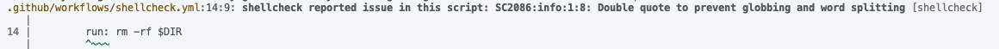

ShellCheckはシェルスクリプトの静的解析ツールだ。文法エラー、バッドプラクティス、セキュリティリスクを指摘してくれる。チェック内容はWikiをみてほしい。

https://www.shellcheck.net/wiki/

## はじめの一歩

Macの場合は`brew install shellcheck`でインストールできる。早速以下のシェルスクリプトに対して解析をかけてみる。

```sh
#!/bin/bash
echo "Deleting files in $DIR..."
rm -rf $DIR
```

解析は`shellcheck vulnerable.sh`で実行する。結果、以下のように表示される。


## GitHub Actions

次にこれをGitHub Actions(以降はGHAと表記する。)で解析することを考える。**実はGHAにはデフォルトでShellCheckが装備されている**。

なので、GHAでシェルスクリプトを実行する前に静的解析をかければ良い。以下のように定義し試してみる。

```yaml
name: shellcheck
on:
  push:
    branches:
      - master
jobs:
  shellcheck:
    runs-on: ubuntu-latest
    steps:
      - uses: actions/checkout@v4
        with:
          ref: ${{ github.head_ref }}
      - name: shellcheck
        run: shellcheck vulnerable.sh
```

すると無事に止まってくれた。


## ワークフローファイル自体に潜む脆弱なコマンドはどうするか

ここまではシェルスクリプトに対して解析をかけていた。だが、GHAではワークフローファイルに以下のように直接コマンドを記述することもできる。

```yaml
# 略
      - name: vulnerable command
        run: rm -rf $DIR
```

これをどう検出するかだが、いきなり答えを出すと`actionlint`を使えば良い。

## actionlint

これはGHAのワークフローファイルを静的解析してくれるツールだ。本来の使い方は、書いたワークフローファイルをいちいちpushしてGHAを動かしてデバッグする…という煩わしい動きを解消するためのツールである。とても便利だ。

https://github.com/rhysd/actionlint

実はこの**actionlintにはShellCheckも盛り込まれている**。すると、ワークフローファイルに直接書かれたコマンドに対しても解析をかけてくれるのである。このことを確認するためにローカルでactionlintを動かしてみる。Macの場合は`brew install actionlint`でインストール可能だ。

インストール後、`actionlint`を実行するだけでワークフローファイルを探して解析をかけてくれる。今回は以下のように怒ってくれた。



あとはactionlintをGit HookやShellCheck同様GHAなどでチェックすればよい。

## おわりに

ShellCheckもactionlintも簡単に使えて効果は絶大だ。明日からでも是非使ってみてほしい。

ついでにだけど、Dockerfileに対する静的解析も過去の記事に書いている。こっちも併せて読んでもらえると参考になると思う。

https://zenn.dev/yskn_sid25/articles/caf5d26ae8a743

---

この記事は当初はてなブログで公開したものを個人ブログ開設にあたって移植したものです。

https://blog.inorinrinrin.com/entry/2025/02/01/232748
