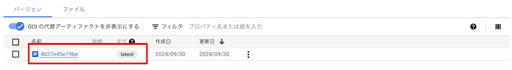
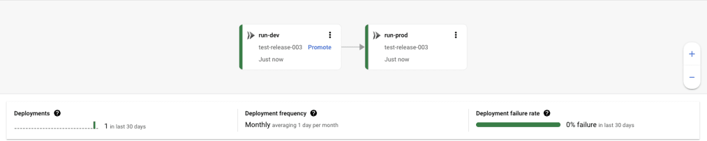
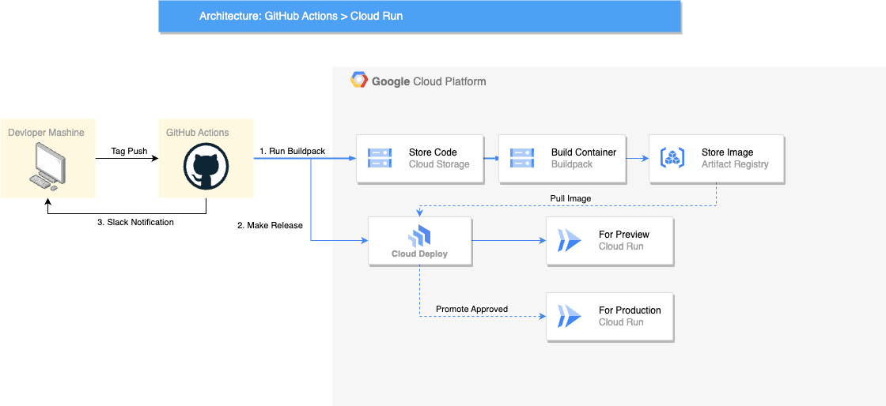
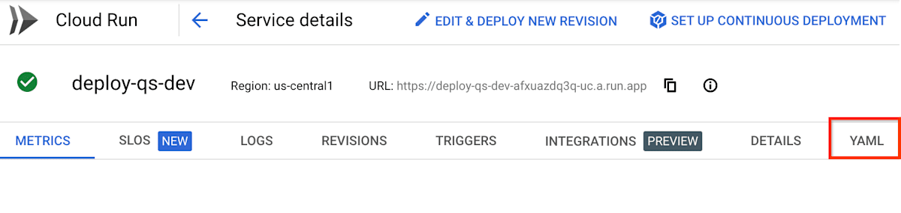

# 導入

ローカルの開発環境は各々のマシンに直接構築し、STGや本番はコンテナの上で動かす。

こういった構成を取ることは珍しくありません。

あるいは、開発用にいろいろライブラリを入れたDockerfileと、本番用に最小限のライブラリのみを入れた構成を取ることもあるでしょう。

このような場合はいずれにしても、Dockerfileを書くということからは逃れられません。

今回は、

> ローカルの開発環境は各々のマシンに直接構築し、STGや本番はコンテナの上で動かす。

という場合に、Dockerfileを開発者が書かずにCloud Runへコンテナイメージをデプロイし、アプリケーションを動かす技術について、実践してみた経験を書いてみようと思います。

# アプリケーション

今回は`node.js`の`v.20.11.0`で動く`Nest.js`10系のアプリケーションを動かしていました。

元のソースは諸事情で詳しい内容は公開できませんが、`langchain`, `zod`, `sequelize`などが一緒に入ってます。

# Dockerfileを書かずにコンテナをビルドする

さっそくこの記事の核心ですが、答えとしては「`Buildpack`を利用する」です。

https://cloud.google.com/docs/buildpacks/overview?hl=ja

やり方は以下のドキュメントに書いてある通りで、めちゃくちゃ簡単です。

https://cloud.google.com/docs/buildpacks/build-application?hl=ja#remote_builds

あらかじめ`Artifact Registry`の保管場所だけ作っておいて、あとはこのコマンドを叩くだけ。

```bash
gcloud builds submit --pack image=LOCATION-docker.pkg.dev/PROJECT_ID/REPO_NAME/IMAGE_NAME
```



ログを見ると以下のように出ており、ローカルのプロジェクトを`tgz`に圧縮して`Cloud Storage`にアップロード後、`Buildpack`がよしなにイメージを作ってくれているっぽいことが見て取れました。

```bash
DONE
------------------------------------------------------------------------------------------------------------------------------------------------------------------------------------
ID                                    CREATE_TIME                DURATION  SOURCE                                                                                    IMAGES                                                                                              STATUS
xxxxxx-e89e-4c8f-8709-024e62629e0b  2024-10-11T13:24:55+00:00  2M48S     gs://xxxx/source/1728653084.56042-1dfc18e1d4ed411da9ac68238e9e8d5a.tgz  <Artifact RegistryのIMAGE_URL> (+1 more)  SUCCESS
```

`Artifact Registry`に作られた最新イメージには`latest`タグが勝手に付与されるので、STG環境であればあとは`latest`タグ付きの最新イメージを`Cloud Run`にデプロイしてあげるだけです。

`Cloud Run`のコンソールであれば、「新しいリビジョンの編集とデプロイ」や、以下のコマンドからデプロイを実行するだけです。

(ただし一番最初のリビジョンができる前に以下のコマンドでデプロイすると、おそらく環境変数など何も設定されていない環境ができてしまうはず)

```bash
gcloud run deploy <PROJECT_ID> --image <IMAGE_URL>:latest --region <REGION>
```

これだとSTGでは仮にまあ良しとしても、本番では良くないですよね。CDできているとはいえなさそうです。

そこで`Cloud Deploy`を使って、`CloudRun`の設定(環境変数やDB接続など)も一緒に作ってしまえるようにしたいと思います。

# Cloud Deployを使ってCloud Runにデプロイする

`Cloud Deploy`を利用することで、あらかじめ指定した構成のCloudRunランタイムをデリバリーパイプラインの形でリリースすることができます。

詳しい説明はドキュメントに譲ります。

https://cloud.google.com/deploy/docs/overview?hl=ja

今回やりたかったことは、「本番デプロイの前にプレビュー環境にデプロイし、動作確認のうえ何らかの承認をトリガーとして本番にデプロイする」ということで、まさにそれを実現してくるサービスです。

`Cloud Deploy`を利用することで、以下のようなデリバリーパイプラインが構成できます。イメージは拝借してきたものですが、プロジェクト名やサービス名が違うだけでほぼこのままのイメージです。


*Cloud Deployのイメージはこちらの記事から拝借*
*https://zenn.dev/google_cloud_jp/articles/cloud-deploy-updates-2023*

今回自分が構築したCDのイメージはこんな感じです。



1. GHAからBuildpackでイメージを作るためにソースをpush
2. イメージがビルドできたら、Cloud Deployのリリースを作成する
3. リリースの作成の作成ができた時点でSlackでPreview環境ができたことを通知
4. 裏でリリースが実行されCloud Run(Preview環境)へ最新イメージをデプロイ
5. プレビューを確認
6. プレビュー確認後、Cloud Deployの画面から「プロモート」を実行
7. プロモートをトリガーにCloud Run(Production環境)へ最新イメージをデプロイ
8. パイプラインの終了

この手順を踏むことで、プレビューで異常が見つかった際にはパイプラインを中断し、本番へのデプロイを止めることができます。

またリリース後に不具合が見つかったとしても、`Cloud Run`側で一つ前のリビジョンにトラフィックを100%流すだけで切り戻しが可能なので、B/Gデプロイができるような状態となっています。

イメージ図について、厳密にはGHAから`Google Cloud`のリソースにアクセスするにあたって`Workload Identity`の認証を噛みますが、この記事の本筋ではないので割愛します。`Workload Identity`の話を知りたい方は、こっちのスクラップを読んでみてください。

https://zenn.dev/yskn_sid25/scraps/81e03b11b1b694

リリース作成の手順は以下に書いてあるとおりです。

https://cloud.google.com/deploy/docs/run-targets?hl=ja

基本はこの手順通りやればいいのですが、今回の構成でハマったところを書き残しておきます。

## ハマりポイント1: Cloud Run の構成ファイルの作成

`Cloud Deploy`には*ターゲット*という概念があり、これが実際にデプロイする先ということになります。

この*ターゲット*を指定したうえで`service.yaml`というファイルを作成する必要があるのですが、ここでCloud Run サービスを定義する必要があり、Cloud Deployはこの定義をもとにCloud Runサービスを作成します。

このサービス定義を作成するにあたって初っ端からYAMLで全て描こうとするのはキャンバスのない空に絵を描くくらい難しいので、手動でCloudRunサービスをまずは作成し、その結果表示されるYAML定義をコピーするのがおすすめです。

YAML定義は以下の場所からコピーすることができます。


*https://cloud.google.com/static/deploy/images/service-details.png?hl=ja*

## ハマりポイント2: Buildpackで作ったイメージURLをどう取得するか？

Cloud Runに対して、「Articfact Registryのどのイメージを指定するか？」を指定する`service.yaml`は以下のように定義します。

```yaml
apiVersion: serving.knative.dev/v1
kind: Service
# 略
spec:
  template:
    # 略
    spec:
      containers:
        - name: container-name
          image: <IMAGE_URL>
```

この`<IMAGE_URL>`が常に一定であれば話は簡単なのですがそういうわけにはいかず、`Buildpack`で作られた最新のイメージURLを取得する必要があります。

「いや、単に`<IMAGE_URL>:latest`と書くだけでは？」そう思っていた時期が私にもありました。

残念ながらそれだとうまくリリースを作ることができず、`<IMAGE_URL>:@sha256:xxxxxxxx`のように指定する必要があるようです。

そのため、以下のようにCDの中で`Buildpack`で最新のイメージを作った後、`Artifact Registry`から最新のURLを取得し、`Cloud Deploy`のリリースを作るということをしています。

```yaml
      - name: Run Buildpack
        run: |
          gcloud builds submit --pack image=<IMAGE_URL>
      - name: Make Release
        run: |
          IMAGE_URL=$(gcloud artifacts docker images describe <IMAGE_URL>:latest --format=json | grep "fully_qualified_digest" | cut -d '"' -f 4)
          RELEASE_NAME=$(date +"%Y%m%d%H%M%S")
          gcloud deploy releases create release-${RELEASE_NAME} \
            --project=<PROJECT_ID> \
            --region=<REGION> \
            --delivery-pipeline=<CLOUD_DEPLOY_PIPLINE_NAME> \
            --images=my-app-image=${IMAGE_URL}
```

```yaml
apiVersion: serving.knative.dev/v1
kind: Service
# 略
spec:
  template:
    # 略
    spec:
      containers:
        - name: container-name
          image: my-app-image # こう書いておくとreleaseコマンドの--images=my-app-image=${IMAGE_URL}で${IMAGE_URL}に置き換えてくれる
```

# 所感

今回`Buildpack`を使ったのは、「かなり小さなマイクロサービスで、Dockerfileを自分で書いたとしても数行で済むだろう」と思ったからです。

だったら人の手で書くことで脆弱性が介入する余地を将来に渡って孕み続けるのなら、いっそのこと信頼できるGoogleに書いてもらったほうが開発者側で責任を持たなくてもいいという発想でした。

なおかつ、Dockerfileの保守をする必要がなくなります。なぜなら、デプロイ時にBuildpackが必要に応じてその時々で最適化されたコンテナイメージを作ってくれるはずだからです。

その上で`Artifact Registry`の脆弱性スキャンを有効にしておけば二段構えで安心できるなと。

仮に`Buildpack`がなくなったとしても、先に述べた通り「かなり小さなマイクロサービスで、Dockerfileを自分で書いたとしても数行で済む」と思っているので、詰むことはないだろうなという感じです。

そうなった時は大人しくDockerfileの保守と戦うことにします。

---

この記事は当初Zennで公開したものを個人ブログ開設にあたって移植したものです。

https://zenn.dev/yskn_sid25/articles/e5a727248849d1
