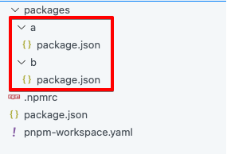
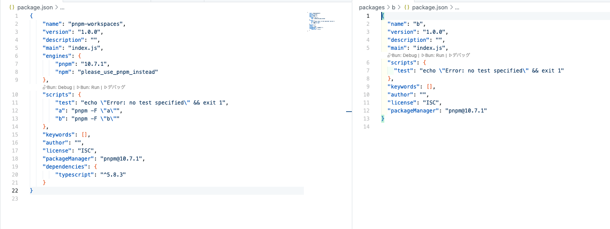
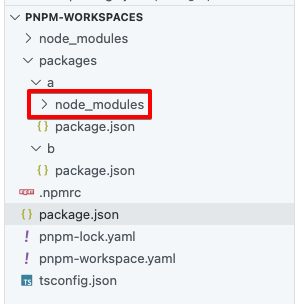
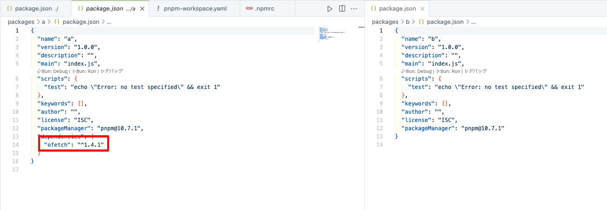
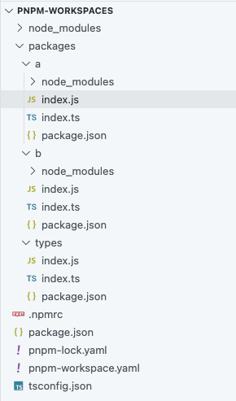
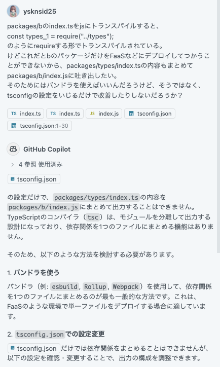

# 前回までのあらすじ

[前回](https://dev.inorinrinrin.com/blog/2ee426b00e64bdb999ba8fc8)は`npm workspaces`に再入門したうえで、`Turborepo`との違いを確認した。

今回は`npm workspaces`と`pnpm workspaces`の違いを見ることにする。

特に**共通で使っているモジュールをうまくバンドルしてくれるか否か**に着目する。

# pnpm workspacesを構築していく

`pnpm`でプロジェクトを作る。

```bash
pnpm init
```

`package.json`が出来上がったら、`pnpm`以外のパッケージコマンド(`npm`, `yarn`)を禁止する設定を入れる。`package.json`と`.npmrc`ファイルに以下のように記述する。

```json title="package.json" ins={6-9}
{
    "name": "pnpm-workspaces",
    "version": "1.0.0",
    "description": "",
    "main": "index.js",
    "engines": {
        "pnpm": "10.7.1",
        "npm": "please_use_pnpm_instead"
    },
    "scripts": {
        "test": "echo \"Error: no test specified\" && exit 1"
    },
    "keywords": [],
    "author": "",
    "license": "ISC",
    "packageManager": "pnpm@10.7.1"
}
```

```title=".npmrc"
engine-strict=true
```

次にworkspaceの設定をする。`pnpm`の場合は`pnpm-workspace.yaml`にワークスペースを定義する。

```yaml title="pnpm-workspace.yaml"
packages:
  - 'packages/*'
```

前回と同じく`a`=`ofetch`, `b`=`axios`でGitHubのissueを取得する。`pnpm`にはworkspaceを指定するオプションがないので、`-F`で特定のパッケージを絞るコマンドを用意するといろいろ捗る。

```json title="package.json" ins={12-13}
{
    "name": "pnpm-workspaces",
    "version": "1.0.0",
    "description": "",
    "main": "index.js",
    "engines": {
        "pnpm": "10.7.1",
        "npm": "please_use_pnpm_instead"
    },
    "scripts": {
        "test": "echo \"Error: no test specified\" && exit 1",
        "a": "pnpm -F \"a\"",
        "b": "pnpm -F \"b\""
    },
    "keywords": [],
    "author": "",
    "license": "ISC",
    "packageManager": "pnpm@10.7.1"
}
```

packageをそれぞれ`a`, `b`として用意。



TypeScriptを使えるようにする。

```bash
pnpm add typescript
npx tsc --init
```

ルートのpackage.jsonに入った。



`a`に`ofetch`を追加してみる。

```bash
pnpm a add ofetch
```

`packages/a`に`node_modules`が出来上がった。



比べてもこの通り。



引き続き`b`に`axios`、プロジェクト全体に`zod`を入れて[前回の記事](https://dev.inorinrinrin.com/blog/2ee426b00e64bdb999ba8fc8)と同じ状況を作る。ソースは前と同じものをコピペして持ってきている。

```bash
pnpm-workspaces % pnpm b add axios
pnpm-workspaces % pnpm add zod
```

jsにトランスパイルする。

```bash
pnpm-workspaces % tsc
```

と、各ディレクトリにjsを吐き出してくれた。



中を見てみる。

```js title="packages/a/index.js" {13}
"use strict";
var __awaiter = (this && this.__awaiter) || function (thisArg, _arguments, P, generator) {
    function adopt(value) { return value instanceof P ? value : new P(function (resolve) { resolve(value); }); }
    return new (P || (P = Promise))(function (resolve, reject) {
        function fulfilled(value) { try { step(generator.next(value)); } catch (e) { reject(e); } }
        function rejected(value) { try { step(generator["throw"](value)); } catch (e) { reject(e); } }
        function step(result) { result.done ? resolve(result.value) : adopt(result.value).then(fulfilled, rejected); }
        step((generator = generator.apply(thisArg, _arguments || [])).next());
    });
};
Object.defineProperty(exports, "__esModule", { value: true });
const ofetch_1 = require("ofetch");
const types_1 = require("../types");
const fetchIssue = () => __awaiter(void 0, void 0, void 0, function* () {
    const url = "https://api.github.com/repos/unjs/citty/issues?state=open";
    const data = yield (0, ofetch_1.ofetch)(url, {
        method: "GET",
        headers: {
            Accept: "application/vnd.github.v3+json",
        },
    });
    const issues = data;
    console.log("Fetched issues:", issues);
    const parsedIssues = issues.map((issue) => (0, types_1.parseGitHubIssueResponse)(issue));
    console.log("Parsed issues:", parsedIssues);
});
fetchIssue();

```

`pnpm`の場合、`node_modules`はそれぞれのディレクトリにできるのでこれでよい。が、`packages`以下のディレクトリで結局ルートにinstallしてる依存関係を使うためには結局バンドルしてあげないとダメそう。

ということで、`pnpm`を使ってもやはりバンドラがないとモノレポとしてうまく機能しなさそうだ。

# 結論

- ワークスペース機能は、ベースとして使いたいパッケージマネージャに依存する
- npmでもpnpmでも依存関係を切り分けて管理できることには違いない

`ts`を`js`に吐き出してるのは`tsc`なんだから、パッケージマネージャがそこをいい感じに書き換えたりとかはするわけないか。当然っちゃ当然。

## Copilotに聞いてみたけど`tsconfig`をこねくり回してもダメそうでバンドラを使う方法しか知らなさそう


